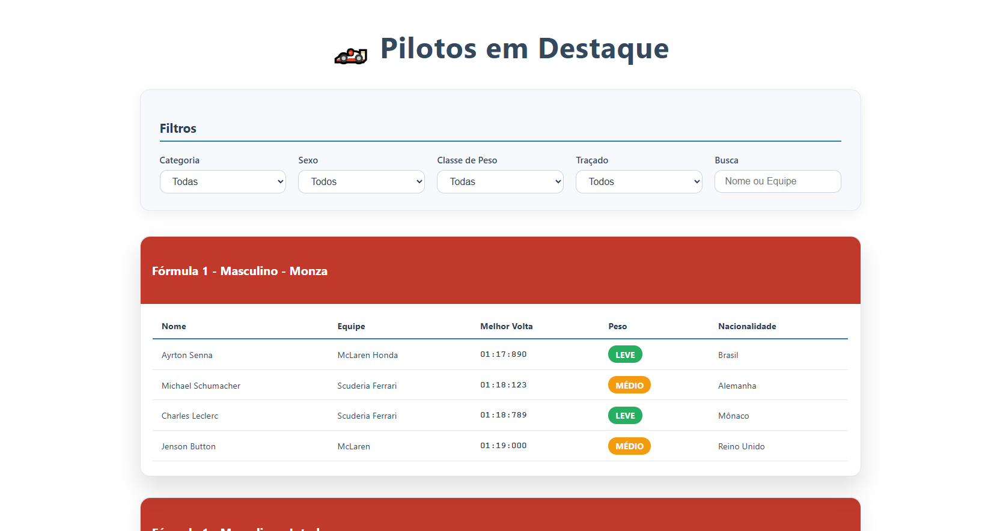

# **RankingPilotos**



> Aplicação web simples para exibir e filtrar pilotos de corridas, categorizados por tipo, sexo, classe de peso e traçado. Projeto desenvolvido em .NET 9 com Blazor Server.

---

## **Funcionalidades**

O **RankingPilotos** oferece as seguintes funcionalidades principais:

-   Lista de pilotos com seus dados detalhados (nome, equipe, melhor volta, peso, nacionalidade e traçado).
-   Filtros dinâmicos por Categoria, Sexo, Classe de Peso, Traçado e busca por nome ou equipe, atualizando a lista em tempo real.
-   Layout responsivo e estilizado com CSS, garantindo uma ótima experiência em diferentes dispositivos.

---

## **Tecnologias Utilizadas**

O **RankingPilotos** foi desenvolvido utilizando as seguintes tecnologias:

| Tecnologia | Descrição                                                                 |
| :--------- | :------------------------------------------------------------------------ |
| **.NET 9** | Plataforma de desenvolvimento principal.                                  |
| **Blazor Server** | Framework para construção da interface web interativa.                  |
| **C#**     | Linguagem de programação utilizada para a lógica da aplicação.            |
| **HTML + CSS** | Tecnologias fundamentais para a estrutura e estilização da interface. |

---

## **Escolhas de Design e Estilo**

O design da aplicação "RankingPilotos" foi concebido com foco em **clareza, usabilidade e uma estética moderna** que remete ao universo do automobilismo. As principais decisões de estilo incluem:

*   **Layout Limpo e Focado no Conteúdo**:
    *   Utilizamos um fundo `body` em tom de cinza muito claro (`#f9f9f9`) para proporcionar uma base suave, contrastando sutilmente com os elementos principais em branco.
    *   O conteúdo é centralizado e limitado a uma largura máxima (`max-width: 1200px`), garantindo legibilidade e uma experiência visual agradável em telas maiores.
    *   O espaçamento generoso (`padding` e `margin`) entre as seções e elementos evita a sobrecarga visual e facilita a navegação.

*   **Organização Visual com Cards**:
    *   Os filtros e os grupos de pilotos são apresentados em **cards** com cantos arredondados (`border-radius: 12px`) e sombras sutis (`box-shadow`), criando uma sensação de profundidade e destacando as informações importantes.
    *   O efeito de `hover` nos cards (`transform: scale(1.02)`) oferece feedback visual ao usuário, indicando interatividade.

*   **Paleta de Cores Estratégica**:
    *   **Neutros (Branco e Cinzas)**: Predominam para manter a interface limpa e profissional, garantindo que os dados sejam o foco.
    *   **Destaques (Vermelho/Laranja)**: O tom avermelhado/laranja nos cabeçalhos dos grupos de pilotos serve como uma cor de destaque vibrante, evocando a energia das corridas.
    *   **Indicadores (Verde e Laranja)**: As tags "LEVE" (verde) e "MÉDIO" (laranja) para a classe de peso são cores funcionais que permitem uma identificação rápida e intuitiva do status.
    *   **Detalhes (Azul)**: Linhas finas em azul claro são usadas como separadores, adicionando um toque de cor e organização sem serem intrusivas.

*   **Tipografia e Legibilidade**:
    *   A fonte `Segoe UI` (ou alternativas sans-serif) foi escolhida por sua clareza e modernidade, garantindo que todas as informações, desde títulos a dados de pilotos, sejam facilmente legíveis.
    *   O uso de `font-weight` para destacar rótulos e nomes importantes melhora a escaneabilidade.

*   **Responsividade**:
    *   O layout foi construído com **Flexbox** para os filtros e **CSS Grid** para a lista de pilotos (`grid-template-columns: repeat(auto-fit, minmax(250px, 1fr))`), assegurando que a aplicação se adapte fluidamente a diferentes tamanhos de tela.
    *   Uma `media query` específica para telas menores (`max-width: 600px`) reorganiza os filtros em uma coluna, otimizando a usabilidade em dispositivos móveis.

Essas escolhas visam proporcionar uma experiência de usuário intuitiva e visualmente atraente, onde a organização dos dados e a facilidade de filtragem são prioridades.

---

## **Como Rodar Localmente**

### **Pré-requisitos**

Antes de executar o projeto, certifique-se de ter os seguintes itens instalados:

1.  **.NET 9 SDK** ou superior.
    *   [Baixar .NET 9 SDK](https://dotnet.microsoft.com/en-us/download/dotnet/9.0)
2.  **Editor de código** (Visual Studio, VS Code, Rider, etc.).

### **Passo a Passo**

1.  **Clone o Repositório**
    *   Abra o terminal ou Git Bash.
    *   Execute o comando abaixo para clonar o repositório:
        ```bash
        git clone https://github.com/seu-usuario/RankingPilotos.git
        ```
    *   Acesse a pasta do projeto:
        ```bash
        cd RankingPilotos
        ```
2.  **Navegue até a Pasta do Projeto**
    *   Acesse a pasta onde está o arquivo `.csproj`. Exemplo:
        ```bash
        cd src/RankingPilotos
        ```
    *   *Obs: Ajuste esse caminho conforme sua estrutura de pastas.*
3.  **Restaure as Dependências**
    *   No terminal, execute:
        ```bash
        dotnet restore
        ```
    *   Isso irá baixar todas as dependências necessárias do projeto.
4.  **Execute a Aplicação**
    *   No terminal, inicie o servidor:
        ```bash
        dotnet run
        ```
5.  **Acesse a Aplicação**
    *   Abra o navegador e vá para o endereço indicado no console (geralmente `http://localhost:5000` ou `http://localhost:5062`).

---

## **Estrutura do Projeto**

A estrutura do projeto está organizada da seguinte forma:

-   `Models/Pilot.cs` — Classe modelo do piloto e enums auxiliares.
-   `Services/PilotService.cs` — Serviço responsável por gerar e filtrar os dados dos pilotos.
-   `Pages/Home.razor` — Página principal da aplicação, contendo os filtros e a listagem dos pilotos.
-   `wwwroot/app.css` — Arquivo de estilos CSS para a aplicação.

---

## **Como Contribuir**

Contribuições são bem-vindas! Siga os passos abaixo para contribuir com o projeto:

-   Faça fork do projeto.
-   Crie sua branch (`git checkout -b feature/nome-da-feature`).
-   Faça commit das suas alterações (`git commit -m 'Descrição da feature'`).
-   Faça push para a branch (`git push origin feature/nome-da-feature`).
-   Abra um Pull Request.
